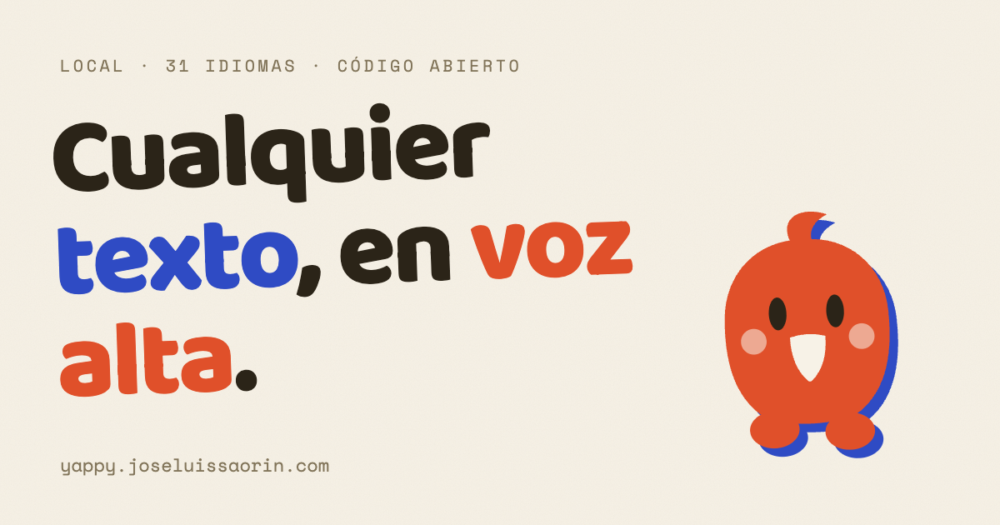

<div align="center">



# Yappy

**Any text, read aloud. Entirely on your device.**

[Website (es/en)](https://yappy.joseluissaorin.com) · [Download](https://github.com/joseluissaorin/yappy/releases/latest) · [Build from source](#build-from-source)

[](LICENSE)
[](https://github.com/joseluissaorin/yappy/actions/workflows/ci.yml)
[](https://github.com/joseluissaorin/yappy/releases)

</div>

---

The whole pitch fits in one gesture: you're reading an article and you have
to start cooking. You share it with Yappy and it starts reading to you while
you cook. Want a book for your walks? Leave it rendering overnight and
listen in the morning.

Everything happens on your device: the voice model (Supertonic 3, ~66M
params, 31 languages), the article extraction, the transcription. No cloud,
no accounts, no telemetry, no per-character fee. MIT.

## The pieces

**The scriptwriter (el guionizador).** Reading aloud is not spelling out.
Yappy turns every text into a *reading script* first: "1492" becomes "mil
cuatrocientos noventa y dos", "siglo XX" is read as a cardinal but "Enrique
VIII" as an ordinal (RAE rules), "Louis XIV" in French is "Louis quatorze",
"EL CID" is *not* a Roman numeral, the FBI gets spelled letter by letter and
NASA doesn't. Numbers in all 31 languages come from a pure-Rust interpreter
of CLDR's RBNF spell-out grammars (gender and Slavic declension included);
dates, times, currencies, units, abbreviations and acronyms have per-language
rules for es/en/fr/de/it/pt. Every transformation is annotated as a *span*
(original range ↔ spoken text), which is what makes the live karaoke
highlight exact instead of a guess. Headings, lists, quotes and verse get
their own breathing (real pauses, slightly slower titles) both live and in
exports. Try it in your browser: the website runs this same Rust code
compiled to WebAssembly.

**The phone (iOS).** A queue-first app: share an article, a YouTube video, a
PDF, an EPUB, a Word file or a voice note from anywhere; it lands in the
queue, gets prepared on-device, and starts reading on its own. Lock-screen
controls, background audio while it keeps synthesizing ahead, a real library
with progress, `.m4b` audiobooks with chapters, Spotlight, widgets, App
Intents for Siri/Shortcuts, and "Open with Yappy" from Files.

**The desktop (macOS, Windows, Linux).** One global hotkey reads whatever
you're looking at: the selection, the browser tab (bundled extension), the
active document, or a screen OCR. A library window keeps every document
you've opened with its edits, and the audiobook editor renders `.m4b` with
chapter markers.

**The bridge.** Pair your phone with your computer by pointing the iPhone
camera at a QR (end-to-end encrypted QUIC via [iroh](https://iroh.computer);
no accounts). Then "convert on your computer": the desktop synthesizes the
whole book at best quality and the finished audiobook lands back in the
phone's library by itself.

## Install

Grab the latest [release](https://github.com/joseluissaorin/yappy/releases/latest):

- **macOS**: `.dmg` (Apple Silicon notarized, Intel)
- **Windows**: `.exe` / `.msi` (x64)
- **Linux**: `.AppImage` / `.deb` (x64)
- **iPhone**: TestFlight soon

First launch downloads the voice model (~380 MB) once. After that Yappy
works offline forever.

## Build from source

```bash
git clone https://github.com/joseluissaorin/yappy
cd yappy/yappy-app
npm install
cargo tauri dev        # desktop
cargo tauri ios build  # iOS (see scripts/fetch-ort-ios.sh first)
```

Rust workspace layout:

```
crates/yappy-core       the engine: Supertonic ONNX inference, the
                        guionizador (guion/, with vendored CLDR RBNF data),
                        chunking, language detection, Parakeet ASR
crates/yappy-wasm       the guionizador compiled for the website demo
yappy-app/src           SvelteKit frontend: (app) desktop shell, (movil)
                        phone hierarchy, /document editor, /read player
yappy-app/src-tauri     the app: capture, playback, queue (cola.rs),
                        bridge (puente.rs), audiobook encoder, per-OS glue
brand/  tooling/marca   the parrot, icons, brand pipeline (regenerable)
web/                    yappy.joseluissaorin.com (static + WASM demo)
```

## Credits

- [Supertonic](https://github.com/supertone-inc/supertonic) (Supertone): the voice model.
- [Parakeet](https://huggingface.co/nvidia/parakeet-tdt-0.6b-v3) (NVIDIA): the ear.
- [CLDR](https://cldr.unicode.org/) (Unicode): the number spell-out grammars.
- [iroh](https://iroh.computer) (n0): the bridge transport.
- [Handy](https://github.com/cjpais/Handy): the original inspiration for
  "one hotkey, fully local".

Made by [José Luis Saorín](https://joseluissaorin.com) in Tenerife. MIT.
